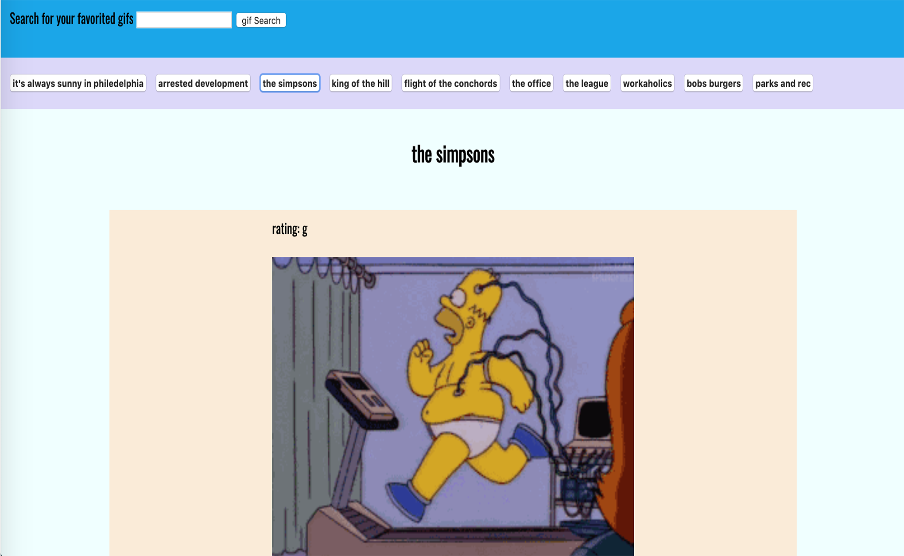

# api-project

This project was built using HTML, CSS, Javascript, Jquery, AJAX and the Giphy API. 

This project was built with JavaScript, jQuery, CSS and HTML. Utilizing the Giphy API you are able to search for and retreive and display up to ten gifs of your chosen subject at a time. By utilizing Jquery and JSON you are able to play and pause the gifs by clicking on them.

live link: https://ogilvie1231.github.io/api-project/

Powered By GIPHY.